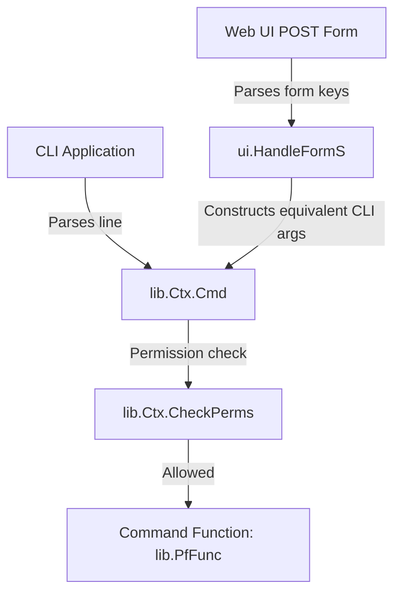

# Pitchfork Architecture and Core Properties

Pitchfork is a highly consistent, modular, and secure web application and command-line framework written in Go. It acts as the foundation for [Trident](https://trident.li) and other identity, group, and wiki management systems.

This document describes the core properties, design patterns, and architecture of the Pitchfork framework.

---

## 1. System Architecture and Directory Structure

The codebase is organized into clear, single-responsibility domains:

*   **`cmd/`**: Application entry points.
    *   `cmd/server/`: Web server daemon (`server.go`).
    *   `cmd/cli/`: Command-line client (`cli.go`).
    *   `cmd/setup/`: System initialization, database schema creation, migrations, and administrative tools (adds first user, resets passwords, sudo testing).
    *   `cmd/wikiexport/`: Command utility to bulk export wiki structures.
*   **`lib/`**: Core business logic, framework, ORM, state handling, and domain modules.
    *   `app.go` & `cfg.go`: Global state and configuration (JSON-based parsing with comments stripping).
    *   `ctx.go`: Context definition (`PfCtx`) containing the request session, transactional DB scope, client IP, language translation, and scopes.
    *   `db.go`: Postgres driver wrapper enforcing auditing, connection pooling, and raw SQL transaction handling.
    *   `struct.go`: Proprietary reflection-based Object-Relational Mapping (ORM) engine.
    *   `system.go`: General system configuration (stored in DB) and auditing extraction.
    *   `user.go`, `group.go`, `ml.go`: Core domain models (users, groups, mailing lists, 2FA, emails, wiki pages).
    *   `iptrk.go`: Goroutine-driven, database-backed IP rate tracking and lockout engine.
*   **`ui/`**: Web front-end.
    *   `ui.go`: Extended context (`PfUI`) adding HTTP parsing, cookie management, response writing, headers, and page templates rendering.
    *   `form.go`: Reflection-based HTML forms compiler.
    *   `root.go`: Main HTTP handler and tree-based path router.
*   **`share/`**: Static assets and resources.
    *   `share/dbschemas/`: Incremental PostgreSQL schema migrations (`DB_0.psql` to `DB_20.psql`).
    *   `share/languages/`: Localization translations.
    *   `share/templates/`: HTML templates.

---

## 2. The Unified Execution Engine Design Pattern

One of Pitchfork's most powerful architectural properties is its **Unified Web & CLI Execution Engine**.

Instead of duplicating business logic between CLI flags/commands and Web UI routes, Pitchfork routes **all** user actions through a single command-tree system:



### Mechanics
1. **Command Definition**: Business actions are defined as `PfMEntry` items, specifying parameter counts, argument types, permission requirements, and the implementation `PfFunc` callback:
   ```go
   type PfFunc func(ctx PfCtx, args []string) error
   ```
2. **Web Form Binding**: When a web form is submitted via POST, `ui.HandleFormS` automatically:
   * Evaluates struct tags to list valid updateable fields.
   * Matches keys present in the form submission.
   * Synthesizes a space-separated CLI command array (e.g., `[]string{"user", "set", "email", "user@example.com"}`).
   * Dispatches the synthesized command directly into `ctx.Cmd()`.
3. **Benefits**:
   * **100% Consistency**: The CLI and Web UI are guaranteed to behave identically.
   * **Zero Duplication**: Developers write a change or validation step once, and it automatically supports both terminal scripts and web interfaces.
   * **Auditability**: Because all writes resolve to commands, the system can audit operations uniformly.

---

## 3. Context & Session State Lifecycle (`PfCtx` & `PfUI`)

Pitchfork maintains request isolation using an explicit context passing pattern:

*   **`PfCtx` Interface**: Extends across all operations. It carries:
    *   `abort <-chan bool`: Client cancellation channel.
    *   `user PfUser`: Currently authenticated caller.
    *   `db_Tx *Tx`: Transaction boundary for the request.
    *   `sel_user`, `sel_group`: Target scopes of the command (who or what group is being acted upon).
    *   `client_ip`: Fully resolved client IP.
    *   `tfunc`: Current localization translation hook.
*   **`PfUI` Interface**: Extends `PfCtx` with Web-only attributes (`http.Request`, `http.ResponseWriter`, cookies, templates metadata).
*   **Impersonation (`Become`)**: Administrative commands or test routines can swap the execution identity inside the context using `ctx.Become(targetUser)`.

---

## 4. Strict Database Auditing & Postgres Wrapper

To meet operational compliance standards, the database wrapper `PfDB` implements **Mandatory Auditing Constraints**:

1. **Explicit Audit Messages**: All SQL writes (inserts, updates, deletes) executed via `DB.Exec` or `DB.QueryRowA` **must** supply a non-empty `audittxt` string. Running a non-`SELECT` query without an audit message triggers a runtime `panic`.
2. **Transactional Integrity**: If a write is made outside an explicit context transaction, `PfDB` opens a short local transaction, executes the statement, inserts the audit entry into the `audit_history` table, and commits or rolls back atomically.
3. **Audit Ingestion**: The audit log captures the acting user (`member`), target user (`username`), target group (`trustgroup`), exact formatted SQL action text, and the remote client IP.

---

## 5. Reflection-Based ORM and Forms Compilation

To reduce boilerplate, Pitchfork avoids third-party heavyweight ORM libraries and instead utilizes two custom Go-reflection engines:

### Dynamic SQL ORM (`lib/struct.go`)
Pitchfork maps Go structs directly to Postgres tables using struct tags:
*   `pfcol`: Specifies the database column name.
*   `pftable`: Specifies the database table name.
*   `coalesce`: Specifies the default value to return for nullable rows.

`StructFetchFields` reads struct tags to automatically construct SQL `SELECT` projection clauses and yields matching scanner destination pointers. `StructFetchStore` maps completed SQL row scans back into the instantiated struct fields.

### Reflective Forms Compiler (`ui/form.go`)
Web forms are rendered directly from database-backed Go structs using the custom `pfform` template function:
*   Reads field datatypes (e.g., `string`, `bool`, `int`, `struct`).
*   Inspects validation constraints such as `min`, `max`, and custom config regex patterns (e.g., `username_regexp`).
*   Enforces structural access rules:
    *   `isvisible`: Points to a struct method that decides if the user has permissions to see the field.
    *   `readonly`: Compiles inputs into static, un-editable text fields accompanied by hidden inputs to keep POST requests intact.

---

## 6. Security and Robustness Measures

Pitchfork implements multiple defensive programming guards:

*   **CSRF Protection**: `ui/ui.go` strictly validates a cryptographic hidden value (`CSRF_TOKENNAME` or `X-XSRF-TOKEN` header) for all POST form requests.
*   **Proxy-Safe IP Resolution (XFF)**: `ParseClientIP` walks the `X-Forwarded-For` chain from right-to-left to locate the first untrusted IP outside of the configured reverse proxy CIDRs (`xff_trusted_cidr`). This prevents header-injection spoofing of client IP addresses.
*   **SysAdmin IP Restrictions (SAR)**: Even if a user's account has the `SysAdmin` flag enabled, administrative actions are rejected unless the resolved client IP falls within the space-separated CIDR block specified in `SARestrict` (excluding localhost/loopback).
*   **IP Lockout Engine (`iptrk`)**: Failed logins or invalid CSRF requests increment a database-backed IP tracking count. When this threshold (`IPtrk_Max`) is breached, requests are locked out. Updates are processed asynchronously via a dedicated background Goroutine to prevent thread congestion during flood attacks.
*   **Stateless JWT Sessions**: Signed private/public JWT tokens track authenticated sessions. To mitigate token leaks, Pitchfork supports token invalidation via a `jwt_invalid` table.
*   **HTML Sanitization**: Utilizes `bluemonday` to cleanse dynamic HTML inputs before they are rendered on Wiki templates.

---

## 7. Multi-Namespace Wiki System

The built-in Wiki system supports dynamic, multi-tenant namespace routing:
*   **Data model**: Wiki paths are mapped in `wiki_namespace` while full histories are kept under `wiki_page_rev`.
*   **Mount points (`Wiki_ModOpts`)**: Wikis can be mounted under different paths (e.g., a global wiki at `/system/wiki` or a group-specific wiki at `/group/<groupname>/wiki`).
*   **Search & Revisions**: Includes built-in search projecting matching snippets and standard revision list retrieval.
*   **Markup**: Uses `blackfriday` to translate markdown to structured, safe HTML bodies alongside automatically synthesized tables of contents (`html_toc`).
